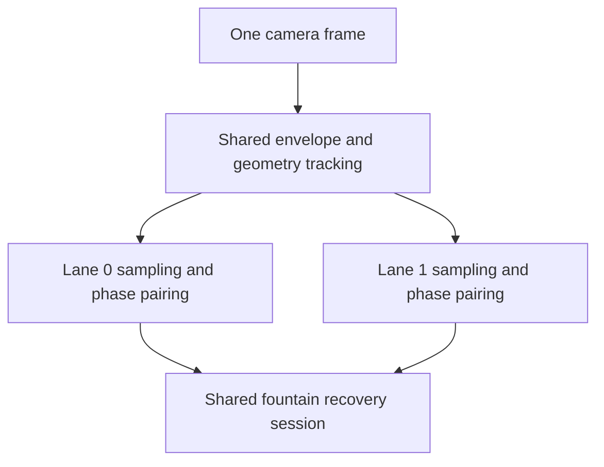

# QRS

**QRS is an experimental, one-way optical file-transfer protocol for moving data from a display to
a camera across an air gap.** During a transfer, the sender and receiver do not need a network
connection, radio link, acknowledgement channel, or shared filesystem.

The sender renders a continuous stream of custom binary matrices. The receiver tracks the matrix,
compares alternating optical phases, validates recovered frames, and reconstructs the original file
from whichever fountain-coded symbols survived the camera channel.

> [!WARNING]
> QRS Protocol v0 is a research prototype. Transfers are currently **not encrypted or
> authenticated**. Do not use it for sensitive data.

> [!CAUTION]
> The current full-matrix A/B inversion produces rapid, large-area, high-contrast flashing. Every
> exposed sub-100 ms mode exceeds three flashes per second and must be treated as a shielded lab
> experiment—not a visually safe public interface. Keep the transmitting display facing the
> camera, do not stare at it, and do not operate it around anyone sensitive to flashing light.
> A non-flashing optical carrier is a release blocker for public deployment.

## Project status

The current release is **v0.1.6 — Multi-lane Foundations**. It preserves the working
browser-to-browser single-lane transfer while making capture, optical-lane state, frame routing,
and recovery ready for dual-lane experiments. It is not yet a high-speed or production-secure
protocol.

| Capability | Status | Notes |
|---|---|---|
| Browser transmitter and camera receiver | Implemented | Dependency-free static web application |
| Automatic matrix detection and tracking | Implemented | Perspective correction, corner smoothing, and tracked-homography reuse |
| Differential A/B optical signalling | Implemented | Alternates a matrix with its inverse to suppress static illumination |
| Loss-tolerant reconstruction | Implemented | Systematic symbols, LT-style repair symbols, peeling, and bounded GF(2) elimination |
| Integrity checking | Implemented | CRC-32C protects optical frames |
| Mobile focus support | Implemented where exposed | Continuous focus and tap-to-focus depend on browser/camera track capabilities |
| 60 FPS camera request | Experimental | Receiver can request 60 FPS; diagnostics report requested, granted, and advertised range |
| Handheld acquisition | Experimental | Works, but motion, focus, glare, display PWM, and pixels per cell still affect throughput |
| Encryption and sender authentication | Not implemented | Reserved protocol identifiers exist; captured footage is currently decodable |
| Adaptive grid density | Planned | Intended to choose a safe matrix size from the measured optical channel |
| Lane-aware framing and recovery | Implemented | CRC-protected lane identity; one decoder accepts symbols from every lane |
| Dual-lane display and scanning | Planned for v0.2.x | Two visible matrices sharing capture and geometry tracking |
| Colour symbols | Research track | Must be calibrated and measured before carrying file data |

The long-term research objective is **150 kbps-class useful throughput** under suitable hardware and
conditions. This is a target, not the performance of v0.1.6. Reaching it will require several
multipliers—better temporal signalling, denser adaptive grids, multiple spatial lanes, soft error
recovery, and potentially calibrated colour modulation—rather than one isolated optimization.

## How the current system works

```mermaid
flowchart LR
    F["Input file"] --> S["Chunk and fountain-code"]
    S --> M["64 x 64 optical matrices"]
    M --> D["Display phase A / inverse phase B"]
    D --> C["Camera capture and frame tracking"]
    C --> P["Perspective sampling and A/B difference"]
    P --> V["Markers, pilot and CRC validation"]
    V --> R["Symbol deduplication and recovery"]
    R --> O["Recovered file"]
```



1. **Transport framing:** the file is divided into source chunks. A compact manifest describes the
   object, and each data frame carries either a systematic source symbol or an LT-style repair
   symbol.
2. **Optical encoding:** each frame becomes a 64×64 binary matrix with orientation anchors, an
   optical phase pilot, and a guarded outer boundary.
3. **Differential signalling:** the transmitter displays the data matrix and then its bitwise
   inverse. Comparing the two observations suppresses static background illumination and glare.
4. **Acquisition:** the receiver detects the outer frame, tracks four corners, and samples cell
   centres through a perspective transform. It can recover rotation and mirroring across all eight
   grid orientations.
5. **Validation:** marker consistency, the phase pilot, weak-cell limits, geometry movement, and
   CRC-32C prevent uncertain observations from entering the decoder.
6. **Recovery:** valid symbols may arrive late, duplicated, or out of order. Fast fountain peeling
   handles simple equations; bounded GF(2) elimination resolves remaining stopping sets.

Because QRS is simplex, the transmitter never learns that reception completed. It continues
transmitting until the receiving user stops it.

## What v0.1.5 and v0.1.6 improved

The v0.1.x series moved the project from exact manual alignment toward practical mobile acquisition:

- Fullscreen-safe black guarding prevents the white optical boundary from merging into a white page.
- Camera-frame-synchronized processing avoids duplicate callbacks and unnecessary work.
- Cached sampling coordinates and reusable buffers reduce allocations in the acquisition hot path.
- Retryable phase windows retain a clean phase A while waiting for a usable phase B.
- Tracking can survive individually rejected optical phases without immediately losing the frame.
- Source-symbol cycling and repair-symbol scheduling reduce the slow completion tail.
- Continuous and point-focus requests are used when the browser exposes those camera controls.
- Diagnostics report timing, lock failures, optical contrast, pixels per cell, phase pairing,
  accepted source/repair frames, duplicates, decoder progress, goodput, and focus results.
- Receiver diagnostics are grouped into transfer, optical, and camera sections; copied reports still
  contain the complete dataset.

Real-device results vary substantially. A successful v0.1.5 field run reported completion at a
67 ms phase duration, but it also showed that marker acquisition and the display-to-camera optical
channel—not file reconstruction alone—remain important bottlenecks. Treat a single phone/browser
result as a diagnostic, not a universal benchmark.

v0.1.6 adds the architectural boundary required for multiple optical regions without activating a
second visible matrix yet:

- Legacy frame flags `0` remain lane 0 of a one-lane session.
- CRC-protected frame flags can identify up to 16 lanes and declare the session lane count.
- Symbols from every lane share one session, global symbol-ID space, duplicate filter, and decoder.
- Each optical lane owns independent sampling memory and A/B phase-pairing state.
- Camera capture and shared envelope tracking are separated from per-lane sampling.
- One projective envelope can be divided into row/column lane quadrilaterals for v0.2 experiments.
- Diagnostics expose configured lanes, active session lanes, and routed frames per lane.

## Run the browser demo

Camera access requires a secure browser context. `localhost` works for development; a second
physical device normally requires an HTTPS deployment such as GitHub Pages or Cloudflare Pages.

```bash
python3 -m http.server 8000 --directory web
```

Open <http://localhost:8000>, then:

1. Open **Send a file** on the display device and choose a small, non-sensitive file.
2. Open **Receive a file** on the camera device and grant camera permission.
3. Keep the complete white matrix boundary and some black surround inside the camera view.
4. Tap the matrix to request focus. Some Android browsers expose no usable point-focus control, so
   QRS will report the actual result in receiver diagnostics.
5. Start transmission. Green tracking means the outer geometry is locked; individual optical
   phases may still be rejected while tracking remains active.
6. Wait for reconstruction, download the result, and compare it byte-for-byte with the source.

Automatic tracking is the normal mode. The fixed-size alignment box exists only as an advanced
manual fallback and is not part of automatic acquisition.

For controlled testing, follow [`docs/two-device-test.md`](docs/two-device-test.md) and save the
diagnostic block from every attempt.

## Build and test the native protocol core

Requirements:

- CMake 3.20 or newer
- A C++20 compiler

```bash
cmake -S . -B build -DCMAKE_BUILD_TYPE=Release
cmake --build build --parallel
ctest --test-dir build --output-on-failure
```

Run an offline transfer with 30% simulated frame loss:

```bash
./build/qrs_offline_demo README.md /tmp/qrs-recovered-readme.md 30
cmp README.md /tmp/qrs-recovered-readme.md
```

The native offline demo validates transport framing and recovery. It does not exercise a display,
camera, browser, or the optical acquisition pipeline.

## Development roadmap

### v0.1.6 — Multi-lane foundations (current)

This milestone keeps transmission single-lane while preparing the implementation for spatial
multiplexing. The following foundations are implemented:

- Separate shared camera capture/tracking from per-lane sampling and classification.
- Introduce reusable per-lane phase-pairing state.
- Extend development framing with protected lane identity and lane count.
- Allow one recovery session to accept symbols from multiple lanes.
- Generalize the acquisition envelope beyond a fixed square.
- Add per-lane diagnostics and deterministic dual-lane intake tests.

Legacy single-lane flags retain their original byte representation, and the browser remains in
single-lane mode. Physical dual-lane throughput is therefore not claimed by v0.1.6.

The validated phone-camera baseline is now **50 ms/phase**. The transmitter exposes only the
sub-100 ms test ladder (67, 50, 40 and 33 ms/phase); slower compatibility modes are no longer part
of the active optimization path.

### v0.2.x — Dual-lane optical acquisition

The proposed dual-lane mode places two independent matrices in one camera image. It should use one
camera callback, one composite-envelope detection, and one shared homography—not two copied video
feeds or two complete scanners.



Portrait displays can stack two nearly full-width square lanes vertically; landscape displays can
place them side by side. Each lane carries different symbols from the same session and continues
contributing even when the other lane temporarily fails. Opposite A/B polarity between lanes is a
candidate for keeping total display brightness steadier.

Two lanes have a raw ceiling of 2× over one otherwise identical lane. The first practical acceptance
target is at least 1.6× combined goodput without worse completion reliability or excessive frame
processing time. Gains beyond 2× require additional changes such as denser grids or richer optical
symbols.

### Later research

- Adaptive matrix density based on camera pixels per cell, blur, and observed contrast.
- Soft cell confidence and stronger forward-error correction.
- Calibrated four- or five-symbol colour alphabets.
- More efficient temporal signalling and rolling-shutter-aware modulation.
- Authenticated encryption with keys exchanged outside the optical recording.

The colour proposal and references are documented in
[`docs/v0.1-optical-acquisition.md`](docs/v0.1-optical-acquisition.md). Colour classifiers must use
captured reference cells and measured confusion matrices; fixed RGB thresholds are not considered a
reliable protocol design.

## Security model

QRS currently provides corruption detection, **not confidentiality or authenticity**. CRC-32C can
detect accidental frame corruption but cannot stop an attacker from modifying data or decoding a
recorded transfer.

The planned security layer should use established authenticated-encryption primitives rather than a
custom cipher. Encryption belongs above chunking and fountain coding so every optical symbol carries
ciphertext, while session metadata binds the transfer to the intended key and protocol parameters.
Key provisioning, replay resistance, metadata exposure, and recovery from interrupted sessions must
be specified before the encrypted mode is called secure.

## Repository map

| Path | Purpose |
|---|---|
| `include/qrs/`, `src/` | Native Protocol v0 framing, optical mapping, CRC, manifest, and FEC core |
| `tools/offline_demo.cpp` | Loss-simulated native encode/recover demonstration |
| `tests/` | Native protocol and recovery tests |
| `web/` | Static browser sender, receiver, acquisition pipeline, and JavaScript tests |
| `docs/protocol-v0.md` | Current binary protocol specification |
| `docs/two-device-test.md` | Reproducible physical-device test procedure |
| `docs/v0.1.*.md` | Milestone decisions, field evidence, and acceptance criteria |

## Design boundaries

- QRS is intentionally simplex; no acknowledgement channel is assumed.
- Protocol v0 is unstable and may change incompatibly between experimental releases.
- A static web deployment distributes the application, but file data travels through the optical
  channel during a transfer.
- Features listed as planned or research work are not present merely because the framing reserves
  space for them.

See [`docs/protocol-v0.md`](docs/protocol-v0.md) for the wire format and
[`docs/v0.1.6-multilane-foundations.md`](docs/v0.1.6-multilane-foundations.md) for the current milestone rationale.
